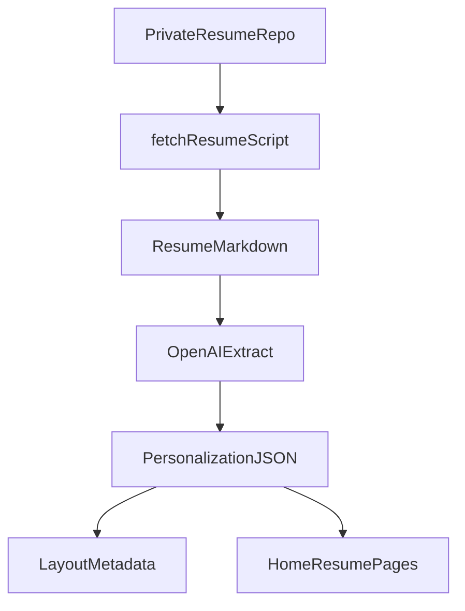

# Project Context

## Purpose

Control plane for personal website with resume, blog, and infrastructure as code.

## Build-Time vs Runtime Summary

Build time fetches and summarizes the resume into structured personalization artifacts, while runtime serves the personalized pages and blog API.

## Instructions (active)

- Use Terraform for infrastructure.
- Include a blog backend with CRUD.
- Provide a documented local Make-based workflow.
- Keep a context log in this file.
- Always update this file when instructions change or new workflows are added.

## Decisions

- Web stack: Next.js + React + TypeScript.
- Blog data: DynamoDB with API routes.
- Deploy target: ECS/Fargate behind ALB with Route53/ACM.
- Personalization: build-time `web/src/content/personalization.json` (generated from resume) is the source of truth; `config/profile.json` provides fallbacks and links.
- Resume content: fetched from private GitHub repo during CI via `scripts/fetch-resume.mjs`.
- OpenAI usage: build-time resume summarization to produce personalization data; runtime usage reserved for future API features.

## Open Questions

- Decide whether to use RDS/Postgres instead of DynamoDB.

## Change Log

- 2026-01-17: Initialized repo structure and baseline docs.
- 2026-01-17: Added personalization config and resume fetch workflow.
- 2026-01-17: Added root .env example for resume repo secrets.
- 2026-01-17: Removed resume repo fields from config; use root .env only.
- 2026-01-17: Docker build now uses repo root context to include config.
- 2026-01-17: Makefile loads root .env for Terraform variables.
- 2026-01-17: Added remote Terraform state + import workflow to improve deploy resilience.
- 2026-01-19: Documented build-time personalization from private resume repo with OpenAI.