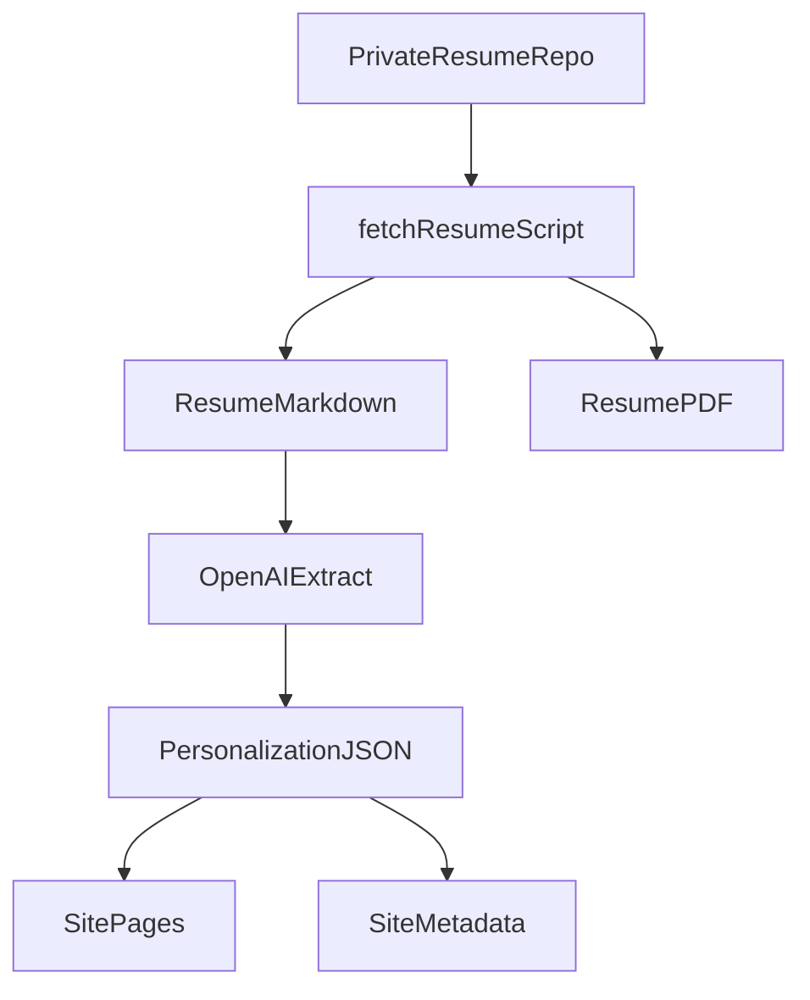

# Personal Website Control Plane

This repo is the control plane for a personal website with a blog backend, infra as code, and CI/CD.

## Stack

- Web: Next.js + React + TypeScript
- Blog API: Next.js API routes (CRUD)
- Data: DynamoDB
- Infra: Terraform
- Deploy: ECS/Fargate + ALB + ACM + Route53 + ECR

## Repo Layout

- `web/`: Next.js app and API
- `infra/`: Terraform for AWS infrastructure
- `scripts/`: setup helpers
- `config/`: personalization config
- `CONTEXT.md`: running decisions and instructions

## Build-Time vs Runtime

Build time focuses on assembling content and infrastructure artifacts. Runtime focuses on serving personalized pages and the blog API.

### Build time

- Fetch resume README/PDF from a private GitHub repo via `scripts/fetch-resume.mjs`.
- Use OpenAI to summarize the resume into `web/src/content/personalization.json`.
- Generate `web/src/content/resume.md` and `web/public/resume.pdf`.
- Build the Next.js app and Docker image; CI/CD applies Terraform and deploys to ECS.

### Runtime

- Serve the Next.js site (home, resume, blog UI) using personalization data with fallbacks from `config/profile.json`.
- Serve blog CRUD API routes backed by DynamoDB.
- Optional future OpenAI usage can be added via API routes (not implemented today).

## Local Setup

1. Install dependencies

```
make setup
```

2. Start DynamoDB local

```
make db-local
```

3. Create the local table

```
AWS_REGION=us-east-1 DYNAMODB_ENDPOINT=http://localhost:8000 \
  BLOG_TABLE_NAME=personal-website-blog-posts \
  scripts/create-local-table.sh
```

If the script is not executable, run `chmod +x scripts/create-local-table.sh`.
Requires the AWS CLI to be installed locally.

4. Copy env example

```
cp web/.env.example web/.env.local
```

5. Fetch resume content from the private repo (required for personalization)

```
RESUME_REPO_TOKEN=... node scripts/fetch-resume.mjs
```

6. Run the dev server

```
make dev
```

## Local Debugging

- App logs: terminal running `make dev`
- API health: `curl http://localhost:3000/api/health`
- Blog API list: `curl http://localhost:3000/api/posts`

## Blog CRUD API

- `GET /api/posts`: list posts
- `POST /api/posts`: create post (admin token required)
- `GET /api/posts/:slug`: fetch one
- `PUT /api/posts/:slug`: update (admin token required)
- `DELETE /api/posts/:slug`: delete (admin token required)

Admin requests require header `x-admin-token` matching `ADMIN_TOKEN`.

Example create post:

```
curl -X POST http://localhost:3000/api/posts \
  -H "Content-Type: application/json" \
  -H "x-admin-token: change-me" \
  -d '{"slug":"hello","title":"Hello","excerpt":"Intro","content":"Full post","tags":["leadership"]}'
```

## Docker

```
make docker-build
make docker-run
```

`make docker-run` uses `host.docker.internal` for DynamoDB. Update the env if your Docker host differs.
Builds use the repo root as context so `config/profile.json` is included in the image.

## Terraform

`make tf-init`, `make tf-plan`, and `make tf-apply` load root `.env` if present.
For local runs, set:

- `TF_VAR_domain_name`
- `TF_VAR_hosted_zone_id`
- `TF_VAR_admin_token` (or `ADMIN_TOKEN`)

To set cost-reporting tags and other defaults, copy the example vars file:

```
cp infra/terraform.tfvars.example infra/terraform.tfvars
```

`infra/terraform.tfvars` is ignored by git. Edit it for per-environment values
like `project_name`, `environment`, `owner`, and `cost_center`.

Initialize and plan:

```
make tf-init
make tf-plan
```

Apply (deploy):

```
make tf-apply
```

Remote state is stored in S3 with DynamoDB locking. If you are importing an
existing stack into state, run:

```
AWS_REGION=us-east-1 STATE_REGION=us-west-2 ./infra/import-existing.sh
```

`STATE_REGION` can differ from `AWS_REGION` when the state bucket lives in a
separate region.

## CI/CD

GitHub Actions will:

1. Build and test the web app
2. Build and push the Docker image to ECR
3. Apply Terraform for deployment

Required GitHub Secrets:

- `AWS_ACCESS_KEY_ID`
- `AWS_SECRET_ACCESS_KEY`
- `AWS_REGION`
- `AWS_ACCOUNT_ID`
- `TF_STATE_REGION` (state backend region, optional if same as `AWS_REGION`)
- `TF_VAR_domain_name`
- `TF_VAR_hosted_zone_id`
- `TF_VAR_admin_token` (or `ADMIN_TOKEN`)
- `TF_VAR_project_name` (optional)
- `TF_VAR_environment` (optional)
- `TF_VAR_owner` (optional)
- `TF_VAR_cost_center` (optional)
- `TF_VAR_service_name` (optional)
- `TF_VAR_additional_tags` (optional JSON map string, e.g. `{"Department":"Engineering"}`)
- `RESUME_REPO_TOKEN`
- `RESUME_REPO_OWNER`
- `RESUME_REPO_NAME`
- `RESUME_REPO_README_PATH`
- `RESUME_REPO_PDF_PATH`
- `RESUME_REPO_REF` (optional)
- `OPENAI_API_KEY`
- `OPENAI_MODEL` (optional, defaults to `gpt-4o` in CI and `gpt-4o-mini` locally)

## Personalization

The site is auto-personalized from a private GitHub resume repo. The build step fetches the resume README/PDF and uses OpenAI to generate structured personalization data.



Edit `config/profile.json` to set name, title, and links. These values are loaded at runtime and can be overridden via environment variables:

- `PROFILE_NAME`
- `PROFILE_TITLE`
- `PROFILE_TAGLINE`
- `PROFILE_LINKEDIN_URL`
- `PROFILE_GITHUB_URL`
Resume repo settings should live in the root `.env` (or CI secrets), not in `config/profile.json`:

- `RESUME_REPO_OWNER`
- `RESUME_REPO_NAME`
- `RESUME_REPO_README_PATH`
- `RESUME_REPO_PDF_PATH`
- `RESUME_REPO_REF`
- `OPENAI_API_KEY`
- `OPENAI_MODEL` (optional, defaults to `gpt-4o` in CI and `gpt-4o-mini` locally)

The resume content is fetched in CI and written to:

- `web/src/content/resume.md`
- `web/public/resume.pdf`

OpenAI is used at build time to generate:

- `web/src/content/personalization.json` (title, tagline, summary, skills, highlights, etc.)

Runtime OpenAI usage is currently not implemented, but the runtime environment can support future on-demand personalization or assistant features via API routes.

You can keep resume repo secrets in a root `.env` file for local runs:

```
cp .env.example .env
```

## Customization

- Update `web/src/app/page.tsx` for homepage sections
- Update `web/src/app/resume/page.tsx` and replace `web/public/resume.pdf`
- Update `web/src/app/blog/*` for blog UI

## Domain & HTTPS

Terraform provisions ACM certs and Route53 records. Supply your hosted zone and domain vars in `infra/`.
